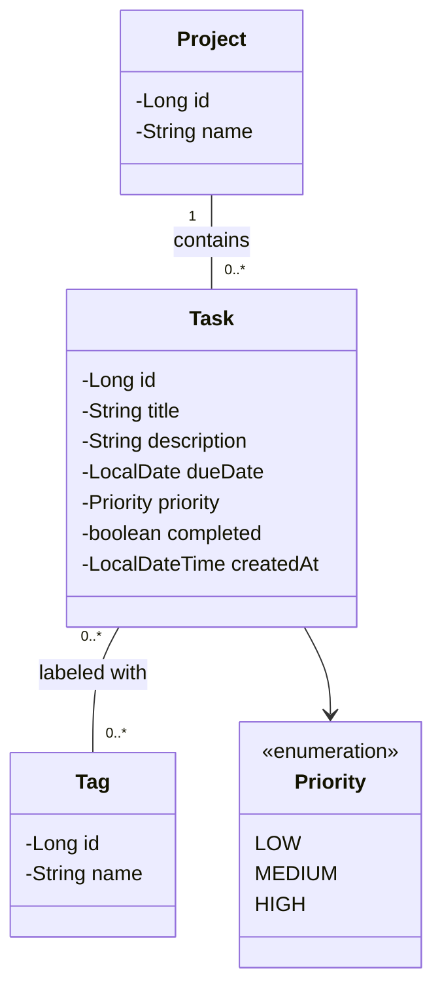

# Class Diagram — To-Do List App

Based on the confirmed v1 scope in [functional-requirements.md](./functional-requirements.md).

## Notes

- **Task** is the core entity: title, optional description, optional due date, priority, completion status.
- **Project** groups tasks (e.g. "Work", "Personal"). A task belongs to at most one project; a project has many tasks.
- **Tag** supports cross-cutting labeling. Many-to-many with Task.
- **Priority** is an enum (`LOW`, `MEDIUM`, `HIGH`) rather than a standalone entity.
